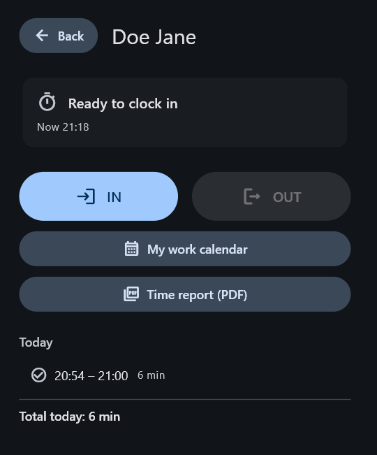
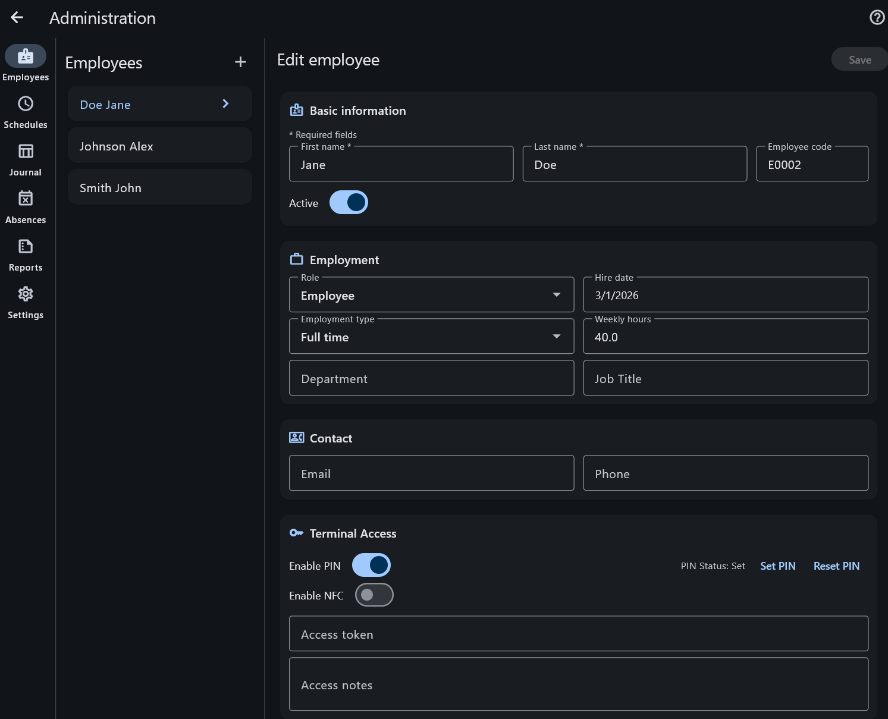
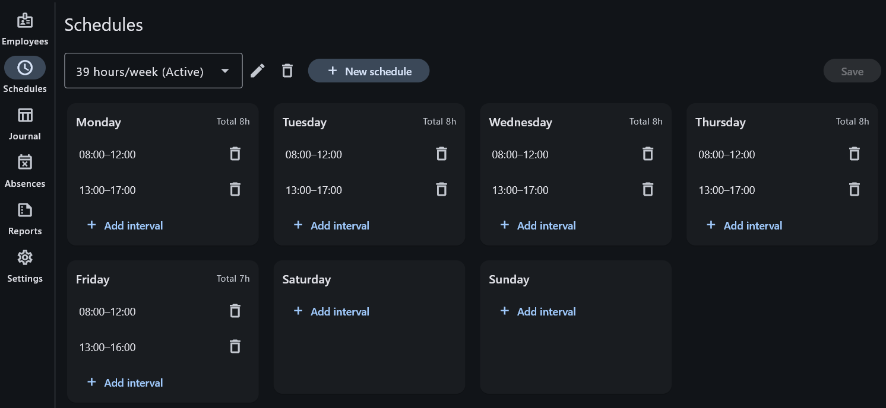
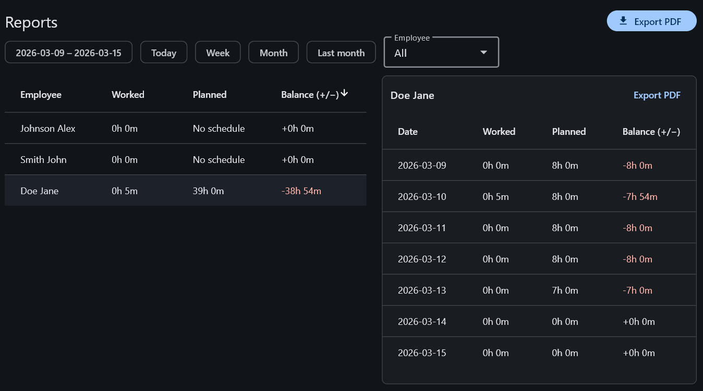
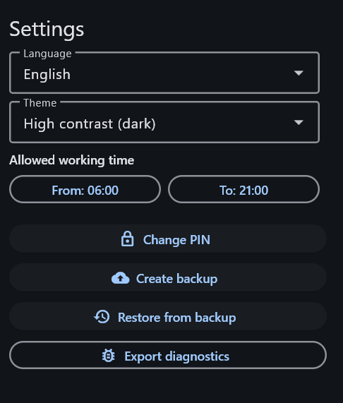

# Timerevo

**Privacy-first desktop time tracking for small teams — fully offline, local-first, and built for simple daily clock-in and clock-out.**

Timerevo is a Windows desktop app for employee time tracking. Employees use the terminal to clock in and out, while admins manage employees, schedules, absences, reports, and settings in the same application.

All data is stored locally in SQLite on the machine. No server. No cloud. No internet connection required for daily use.

## Why Timerevo

- **Fully offline** — no cloud dependency and no server setup
- **Local-first by design** — all records stay on the machine
- **Simple terminal workflow** — fast employee clock-in and clock-out
- **Optional PIN protection** — additional access control for employee check-in
- **Built for small teams** — practical for single-workplace and small business setups
- **Admin tools included** — employees, schedules, journal, absences, reports, and settings
- **Backup and restore** — easy local data protection
- **Multilingual UI** — German, Russian, and English
- **Accessible themes** — light, dark, and high-contrast

## Project status

**Early release**. Core workflows are implemented and usable.

Currently available and ready to use:

- employee clock-in / clock-out
- employee management
- schedule templates
- work session journal
- absence requests and approvals
- PDF reports
- backup and restore
- localization and theme settings

## Features

### Terminal

The terminal is designed for fast daily employee use.

- select employee profile
- enter PIN if enabled
- clock **IN** / **OUT**
- view personal work calendar
- export personal time report to PDF

### Administration

The admin area includes all core management tools.

#### Employees

- create and edit employee profiles
- assign employee code and role
- enable, set, or reset PIN
- assign schedule templates
- mark employees as active or inactive

#### Schedules

- create and manage schedule templates
- define working intervals per weekday
- support schedules that cross midnight

#### Journal

- browse recorded work sessions
- filter by employee, date range, and status
- edit start and end time
- add notes and update reasons

#### Absences

- manage absence requests
- approve or reject requests
- keep planned and unplanned time off in one place

#### Reports

- generate summaries by employee and period
- export reports to PDF

#### Settings

- change language and theme
- configure allowed working hours
- change admin PIN
- create and restore backups
- export diagnostics for support

## Screenshots

### Terminal

### Employees

### Schedules

### Reports

### Settings

## Supported platform

Timerevo currently supports:

- **Windows 10 / 11 (64-bit)**

## Run from source

### Requirements

- Flutter SDK compatible with the project
- Windows development environment for Flutter Desktop

### Start locally

    flutter pub get
    flutter run -d windows

## Build

To build the Windows desktop application:

    flutter build windows

Build output:

    build/windows/x64/runner/Release/

## Distribution

The project is currently distributed as a standalone Windows build.

- no installer
- unpack the release archive
- run `timerevo.exe`

**Default admin PIN:** `0000` — change it in Administration → Settings.

To create a distributable zip:

    .\tools\build_release.ps1

## Tech stack

- **Flutter**
- **Material 3**
- **Riverpod**
- **Drift**
- **SQLite**

## Project structure

    lib/
    ├─ app/        # Bootstrap, router, theme, init
    ├─ common/     # Shared widgets and utils
    ├─ core/       # Domain errors, config, pure utils
    ├─ data/       # DB, repositories
    ├─ domain/     # Use cases, ports, entities
    ├─ features/   # UI and feature logic
    ├─ l10n/
    └─ ui/         # App-wide screens (legal, etc.)

## Data storage

Timerevo stores its local database on the machine.

Typical database location on Windows:

    %LOCALAPPDATA%\timerevo\timerevo.sqlite

This keeps the application self-contained and easy to back up or restore.

## Documentation

### User guides

- [English User Guide](USER_GUIDE_EN.md)
- [Russian User Guide](USER_GUIDE_RU.md)
- [German User Guide](USER_GUIDE_DE.md)

## Contributing

Contributions, bug reports, and improvement suggestions are welcome.

Please read [CONTRIBUTING.md](CONTRIBUTING.md) before opening an issue or submitting changes.

## License

This project is licensed under the terms of the license included in this repository. See the [LICENSE](LICENSE) file for details.
